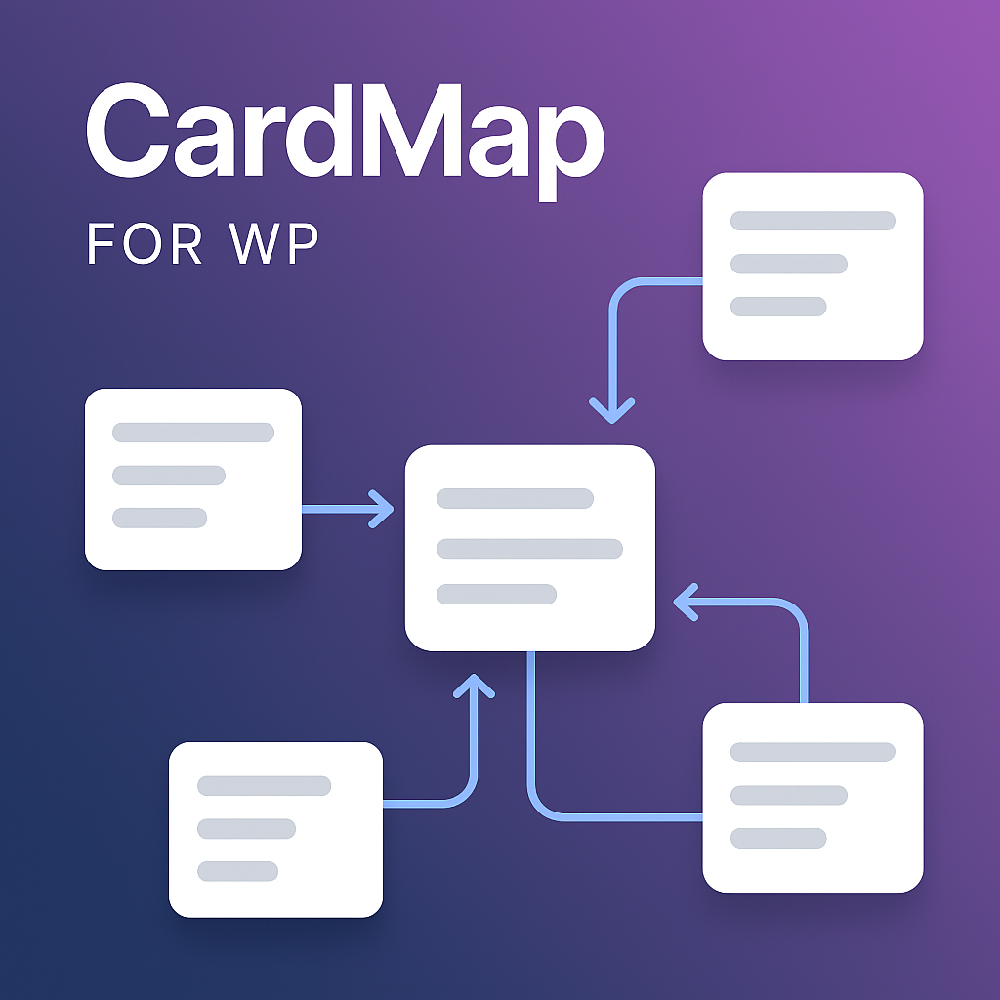

# CardMap for WP

A WordPress plugin for creating interactive, node-based maps with connections. Built with jsPlumb, this plugin allows you to visually design and display complex diagrams, flowcharts, or maps on your WordPress site using a simple shortcode.

## Features

- **Custom Post Type:** Adds a "CardMaps" post type to your WordPress admin for easy management.
- **Visual Editor:** A drag-and-drop interface to add, position, and connect nodes (cards).
- **Node Customization:** Add titles, captions, images, and links to each card.
- **Connection Styling:** Customize the color, thickness, and style of the connecting lines.
- **Rails System:** Add horizontal or vertical rails to align nodes neatly.
- **Frontend Rendering:** Display your map on any page or post with the `[cardmap id="..."]` shortcode.
- **Interactive Frontend:** Users can pan and zoom the map for better viewing.
- **Fullscreen Mode:** A dedicated button to view the map in fullscreen.

## Installation

1.  Download the plugin as a `.zip` file from the GitHub repository.
2.  In your WordPress admin dashboard, navigate to **Plugins > Add New**.
3.  Click **Upload Plugin** and select the `.zip` file you downloaded.
4.  Click **Install Now** and then **Activate Plugin**.

## How to Use

1.  After activating the plugin, a new **CardMaps** menu will appear in your WordPress admin sidebar.
2.  Click **CardMaps > Add New** to create a new map.
3.  Give your map a title and use the visual editor on the page to build your map:
    - **Add Node:** Creates a new card on the canvas.
    - **Add Rail:** Adds a horizontal or vertical rail for alignment.
    - **Connect Mode:** Click this, then click two nodes to draw a connection between them.
    - **Delete Mode:** Click this, then click a node to delete it.
4.  Double-click any node to edit its content (title, caption, image, link).
5.  Click the **Save Map** button in the editor toolbar to save your progress.
6.  Once you are finished, click the main **Publish** or **Update** button for the post.
7.  To display the map, copy the shortcode provided in the "Shortcode" meta box (e.g., `[cardmap id="123"]`) and paste it into any post or page.

## Changelog

### v1.5.0 (2025-10-03)

- Added rail appearance controls in the admin editor: rail style (solid/dashed/dotted), color picker, and thickness.
- Improved rail settings panel positioning: panel now appears adjacent to the hovered rail and respects pan/zoom.
- Fixed plugin update checker slug and published release tags so WordPress can detect updates.

### v1.5.1 (2025-10-03)

- Added additional rail appearance styles (dash-heavy, dash-subtle, double-line, striped, gradient, embossed) and improved dashed rendering for better visibility.
