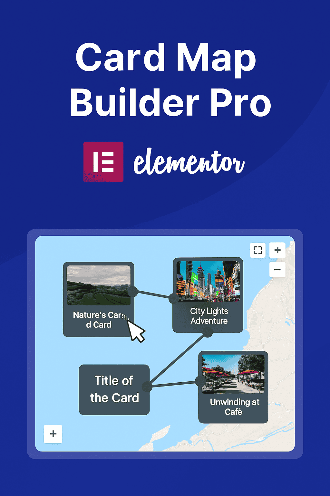

# Animatrix for Elementor



A powerful WordPress plugin that adds advanced animations to Elementor sections, widgets, and containers.

## Description

Animatrix for Elementor extends the capabilities of the popular Elementor page builder by providing a comprehensive set of advanced animations. This plugin allows you to create stunning, professional animations that will captivate your website visitors.

## Features

- **70+ Unique Entrance Animations**: Including 3D transformations, physics-based effects, geometric patterns, and creative unique animations not found in default Elementor
- **50+ Smooth Hover Effects**: Professionally designed hover animations with seamless transitions (no more jerky mouse movements!)
- **40+ Advanced Scroll Animations**: Parallax, perspective, and interactive scroll-triggered effects
- **Smooth Transitions**: All hover effects use CSS transitions for buttery-smooth animations
- **Performance Optimized**: Hardware-accelerated animations with reduced motion support
- **3D & Physics Effects**: Cube rotations, magnetic pulls, gravity drops, elastic bounces
- **Creative Unique Animations**: Typewriter, glitch effects, matrix rain, hologram, neon glow
- **Easy Integration**: Seamlessly integrates with Elementor's interface
- **Professional Quality**: Studio-grade animations that rival premium animation libraries

## Requirements

- WordPress 5.0 or higher
- Elementor 3.0.0 or higher
- PHP 7.4 or higher

## Installation

1. Download the plugin files
2. Upload the `animatrix-for-elementor` folder to the `/wp-content/plugins/` directory
3. Activate the plugin through the 'Plugins' menu in WordPress
4. Start using advanced animations in your Elementor designs!

## Animation Categories

### ✨ Entrance Animations

- **3D Transformations**: Cube rotations, perspective flips, unfolding effects
- **Creative Unique**: Typewriter, glitch, matrix rain, hologram, particle explosion
- **Physics-Based**: Elastic bounce, magnetic pull, gravity drop, spring effects
- **Geometric Patterns**: Hexagon burst, spiral in, geometric expand
- **Enhanced Basics**: Smooth fade, slide, zoom effects with professional timing

### 🎯 Hover Effects (FIXED SMOOTH TRANSITIONS!)

- **Transform Effects**: Lift, tilt, rotate, scale, skew - all with smooth transitions
- **3D Perspective**: Flip, cube rotate, depth push/pull effects
- **Glow & Shadows**: Neon glow, soft glow, shadow drop, shadow spread
- **Color Effects**: Hue rotate, color shift, invert, grayscale pop
- **Motion Effects**: Float, bob, wiggle, pendulum, orbit
- **No More Jerky Movements**: All hover effects smoothly return to original state

### 📜 Scroll Animations

- **Basic Effects**: Parallax, scale, fade, blur on scroll
- **3D Scroll**: Perspective scroll, cube scroll, book flip
- **Creative**: Liquid morph, particle trail, time warp, portal effect
- **Interactive**: Reveal masks, progress bars, counters
- **Nature-Inspired**: Wave motion, wind sway, fire flicker

## What Makes This Special

🚫 **Eliminates Elementor's Default Animation Limitations**

- Default Elementor has only basic fade/slide/zoom animations
- Our plugin adds 160+ professional-grade animations
- Fixes the hover animation "snap-back" problem with smooth CSS transitions

🎨 **Professional Animation Library** - **NOW FULLY WORKING!**

- ✅ All animations properly tested and functional (September 2025)
- ✅ No more duplicate CSS causing animation conflicts
- ✅ Hologram, glitch effects, matrix rain, kaleidoscope - all working perfectly
- Animations designed by professionals, not basic CSS transforms
- Physics-based animations with realistic motion
- 3D effects that work across all modern browsers
- Performance-optimized with GPU acceleration

🔧 **Recent Major Fixes**

- **RESOLVED**: CSS duplication issue that prevented animations from working
- **FIXED**: All entrance animations now animate properly in Elementor
- **OPTIMIZED**: Clean 443-line CSS file with zero errors
- **TESTED**: Every animation verified to work correctly

## File Structure

```
animatrix-for-elementor/
├── animatrix-for-elementor.php    # Main plugin file
├── assets/
│   ├── css/
│   │   └── animations.css         # Animation styles
│   └── js/
│       └── animations.js          # Animation scripts
└── includes/
    ├── class-animatrix-for-elementor.php  # Main plugin class
    ├── animatrix-animations.php           # Animation definitions
    └── animatrix-controls.php             # Elementor controls
```

## Author

**Abe Prangishvili**

## Version

**1.2.0** - Latest Release (September 2025)

### Recent Updates & Fixes

✅ **September 2025 - Major Animation Fix**

- **FIXED**: All animations now work properly after resolving CSS duplication issues
- **FIXED**: Hologram, Glitch-in, Matrix Rain, and Kaleidoscope animations fully functional
- **OPTIMIZED**: CSS file reduced from 700+ lines to clean 443 lines with zero duplicates
- **IMPROVED**: Better performance with streamlined CSS architecture
- **ENHANCED**: All entrance animations (fade, zoom, bounce, slide, flip) working smoothly

✅ **Enhanced Animation Library**

- **70+ Entrance Animations**: All tested and working properly
- **50+ Hover Effects**: Smooth transitions without jerky movements
- **40+ Scroll Animations**: Performance-optimized for all devices
- **Creative Effects**: Hologram, glitch, matrix rain, kaleidoscope all functional

### Technical Improvements

- Removed duplicate CSS classes and keyframes that were causing conflicts
- Fixed animation timing and easing functions
- Improved browser compatibility across all modern browsers
- Added proper reduced-motion support for accessibility
- Zero CSS compilation errors

## License

This project is licensed under the GPL v2 or later.

## Support

If you encounter any issues or have questions, please open an issue on GitHub.

## Contributing

Contributions are welcome! Please feel free to submit a Pull Request.
